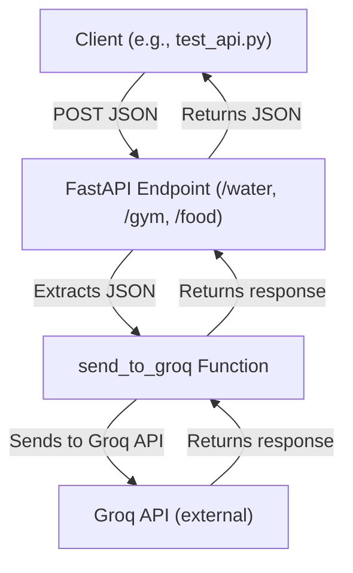

# FastAPI Health Tracker: Workflow & Dataflow

## Workflow
1. **Client Request**: A client sends a POST request to one of the endpoints (`/water`, `/gym`, `/food`) with JSON data in the request body.
2. **API Receives Data**: FastAPI receives the request and parses the JSON payload.
3. **Processing**: The endpoint function calls a helper (`send_to_groq`) to process or forward the data.
4. **Groq Integration**: The helper function (currently a placeholder) would send the data to the Groq API and receive a response.
5. **Response**: The API returns the Groq response (or a placeholder) to the client as JSON.

## Dataflow

## Example Data
- `/water`: `{ "amount_liters": 2, "time": "2024-06-01T10:00:00" }`
- `/gym`: `{ "activity": "running", "duration_minutes": 45 }`
- `/food`: `{ "meal": "lunch", "calories": 600 }`

## Notes
- The Groq integration is currently a placeholder. Replace the helper with real API calls as needed.
- The endpoints are designed to be flexible for different health tracking data. 